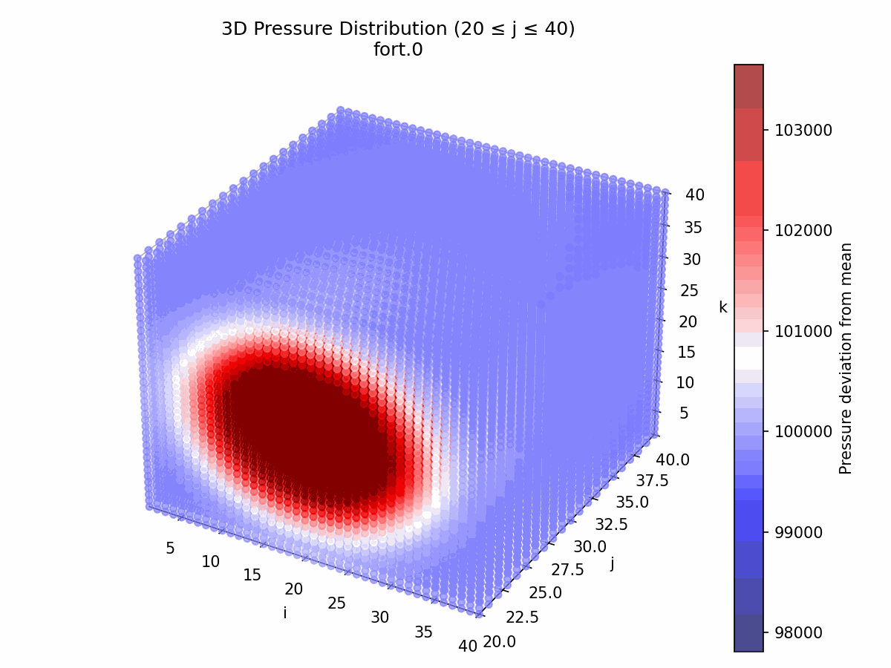

# CFD (to be MultiPhysics) (to be FE) Simulator in NVFORTRAN for parallelized CPU or GPU
Currently just simulates water with a pressure gradient and suffers to be numerically stable

Finite Element setup in developement once BVP solver implimented in each cell

## Current Simulation
The manifold is a 3d mesh of cubic cell objects which can be assigned a conserved quantity vector U(:) and uses a subroutine to set it up from water. Will be modularized later to impliment a standard process of adding a different simiulation kernel (ie plasma). The manifold gets updated by calculating a tangent bundle, where the Rusanov flux across every face is calculated and stored in tangent bundle mesh which can be used to write the t+1 state of the corresponding cell of the main manifold. The comparison of t,t+1 values is used for smoothing to help numerical stability (doesn't do a lot lol). There is a smoothing post processing script that handles it indirectly, but lasting numerical stability is going to be a dedicated effort. 

Simulation runs and logs time.

**Current Setup**

Runs a 40x40x40 model over .2 seconds (100 timesteps of 0.002s ) 
* gets pretty unstable quickly after this (no longer sparse NaN (>1%))
* computes on parallelized CPU threads (12 threads with 16GB RAM)

**Results**



For the displayed data I got:
```
 Total Computation Time:     9.188940 seconds
   Simulation Timesteps:   100.000000 steps
    Simulation Duration:     0.200000 seconds
```

## Working on the Sim

I have a .vscode command to launch the container, assuming you have docker desktop (at least CLI) set up and the CUDA compiler files set up in /opt/ in sudo directory. 

**Launch Container**

run task Start Docker Container

**Set Up Environment**

Sometimes it doesnt work on its own so you can manually do it with this
```bash
./.devcontainer/setup.sh
```

**Compiling Fortran**

There is a makefile system set up so simply 
```bash
cd kernel
```
then you can do 
```bash
make
```
to compile, and 
```bash
make clean
```
to clear the build files. 
```bash
empty
```
clears all the data/ folder files. I also have gdb set up so you can run 
```bash
make debug
```
and use gdb to debug it. 

**Verbose compiling**

If you set the variable isDebug in kernel/numtype.f90 to 1, debug print statements go through
```
integer, parameter :: isDebug = 1
```

**Running the Current Test Program**

Right now, the main script is in kernel/testing/cfdtest.f90. After you compile, you can execute it from kernel/ with 
```bash
./cfd
```


## Scripts 
I have some QOL scripts

__in ROOT__

* gitmain   -> git push to main branch
* gitster   -> "" master
* gitbranch -> "" $USER_INPUT_BRANCH

* ./pyinterface/plot.py   -> plots data and makes gif
* ./pyinterface/smooth.py -> smoothes data to avoid poles


__in ROOT/kernel__

* empty -> cleans data/ folder

## Smoothing
Numerical stability is hard, but when divergences are sparse, a simple smoothing postprocessing script can work. Using
```bash
./pyinterface/smooth.py
```
the files in kernel/data are scanned for NaNs and they are smoothed by the average of the enclosing neighboring cells, including diagonals. Any NaNs found touching others extends the boundary recursively so it encloses the whole NaN cluster and finds the total average of enclosing domain cells.

## Plotting
The plotting here is based around mean fluctuations because they are not super visible with respect to scale of the system, and it does not run long enough before losing stability to get significant changes. 


# Scalability
The model gets allocated on host and, while not modularized at the moment, one can add a different kernel, cell computations, and tangent bundle tensor to change the simulation. There are some hardcoded num_conserved_values=5 instances, but can easily be (***TODO***) **made arbitrary and build a kernelLoader type that lets the user build a kernal from an abstract interface that the loader can seed the Manifold with**

# NOTES
The gif, even though smoothed, clearly shows NaN instability growing near the end of the simulation. This seems to be only on the boundaries, so the boundary conditions are potentially where they could be coming from
* Boundary conditions may lead to feedback loops under the right conditions that create divergences at boundary

## Important TODOs

* **Modularize setting boundary conditions <=> could solve some divergences if treated carefully**
* **Allow all the properties written to the conserved quanitities vector to be accessed dynamically so feedback can be incorporated for multiphysics simluation**
* **Integrate Lapack and the matrix.f90 wrappers file with d01b.f90. With chebyshev.f90, this gives EXTREMELY stable numerical integration, root solving, and differentiation.**
* **MAKE MORE NUMERICALLY STABLE**
    * Use chebyshev routine to calculate differentials using recursion where possible to improve the Rusanov process
* **GPU Methods**
* **Pipeline the build process that wraps with python to plot outputs**


